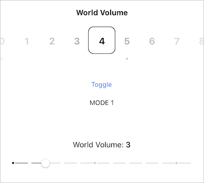

----

# worldVolumeSlider

A Swift implementation of world volume custom sliders, one as a collection view with inertia, the other as a custom UISlider. I believe that the toggle button used to swap out the array for item labels, but that looks like I abandoned that functionality. 

## TODO items

- [ ] Create a code-only version of the collection view slider.
- [x] Get all this into source control.

----

